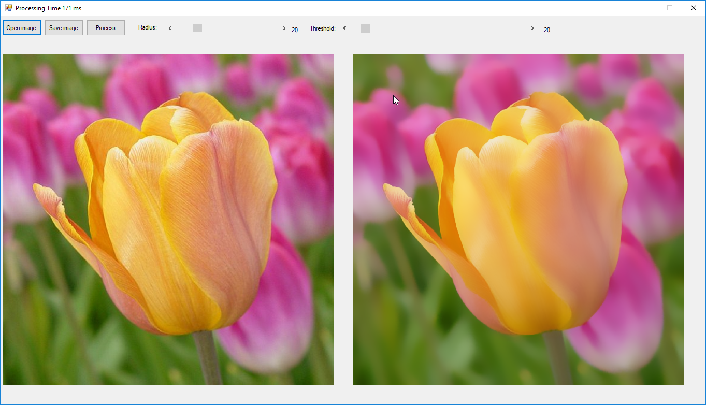

# **Surface Blur**

This is an optimized algorithm for blurring an image while preserving edges. The Radius sets the sample area while Threshold controls how much the tonal values of neighboring pixels must diverge from the center pixel before being included in the blur.

